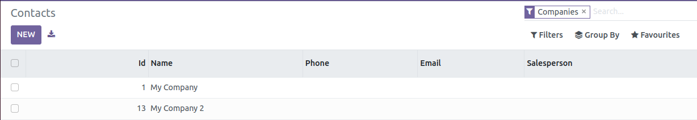
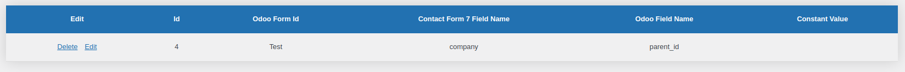

# Relational Field Examples

The Record ID field is often referred to `id` on base models. You can get the ID from a record because it will 
be one of the parameters in the URL (as `?id=<id>`) when viewing the record.

## Many2One

This example will show you how to choose a company for a contact record. This is an example of the companies in the Odoo instance. 



CF7 Form: 

```
[select company "My Company|1" "My Company 2|13"]
```

Form Mapping Record: 



# One2Many

Not supported currently

# Many2Many

Not supported currently
