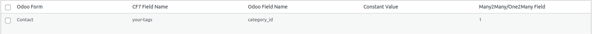
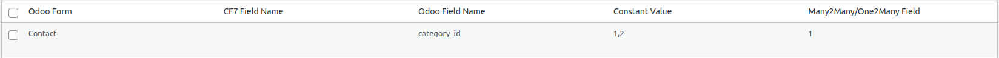

# Relational Field Examples

The Record ID field is often referred to `id` on base models. You can get the ID from a record because it will 
be one of the parameters in the URL (as `?id=<id>`) when viewing the record.

## Many2One

This example will show you how to choose a company for a contact record. This is an example of the companies in the Odoo instance. 


CF7 Form: 

```
[select company "My Company|1" "My Company 2|13"]
```

Form Mapping Record: 


# Many2Many and One2Many

When creating form mappings for M2M or M2O fields, ensure the "Many2Many/One2Many field" checkbox is ticked. 

This example will show you how to add tags to a contact on submission. 


## With checkboxes

CF7 Form: 
```
[checkbox your-tags use_label_element "tag1|1" "tag2|2" "tag3|3"]
```

Form Mapping Record: 



## With constant tags

Form Mapping Record for always adding tags with the ids 1 and 2:


