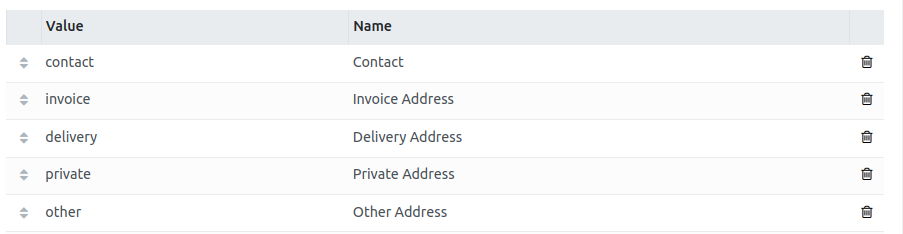
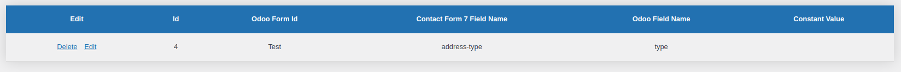

# Simple Field Examples

Most fields are self-explanatory, but this section details some that might not be so obvious. 

## Selection

Example selection data is the `address_type` field on the `res.partner` (contact) model:



CF7 Form:

```
[select address-type "Contact|contact" "Invoice Address|invoice" "Delivery Address|delivery" "Private Address|private" "Other Address|other"]
```

Form Mapping Record: 


